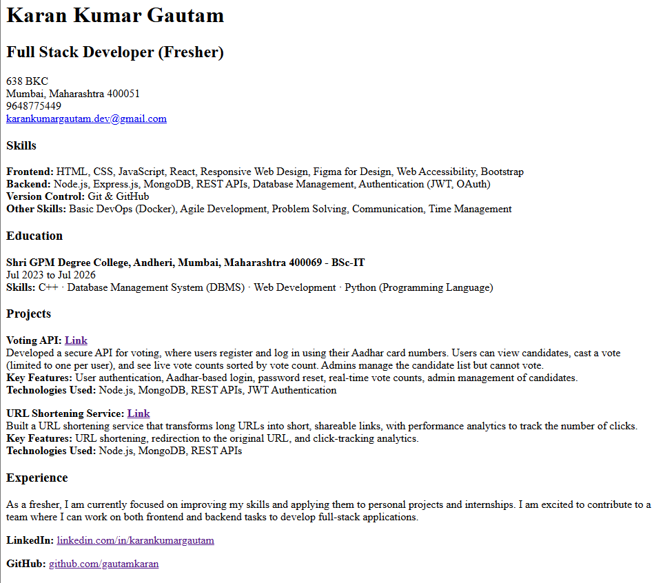
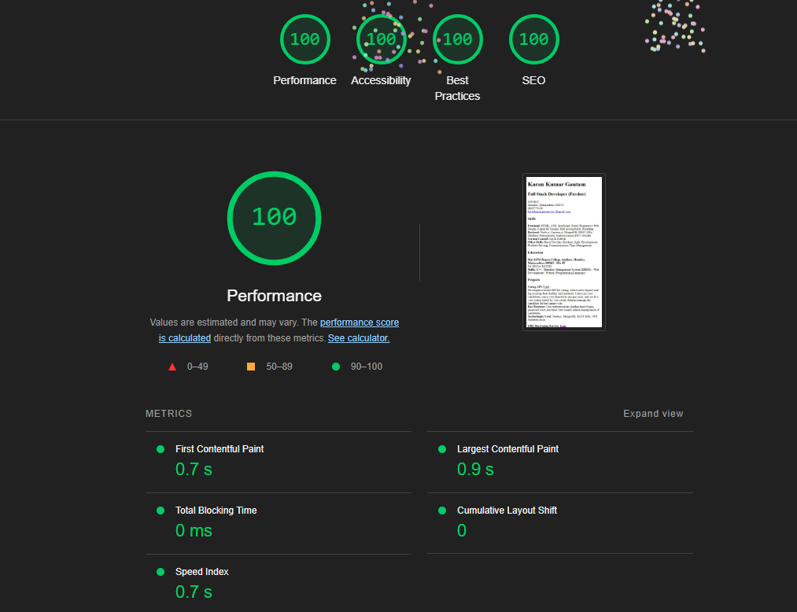

# Single-Page CV

This project demonstrates how to create a **Single-Page CV** using **HTML**. The goal is to structure your career history, skills, education, and projects in a semantic and clean way. The layout is designed to be easy to style later with CSS.

## Features

- **Semantic HTML**: The HTML structure is simple, clear, and semantic, using appropriate tags like `<header>`, `<section>`, and `<footer>`.
- **SEO Meta Tags**: Meta tags are included for improved search engine visibility.
- **Open Graph Tags**: Optimized for better sharing on social media platforms.
- **Favicon**: The page includes a favicon for branding and easier identification in browser tabs.

## Sections of the CV

1. **Header**: Includes your name and professional title.
2. **Contact**: Contact details (address, phone number, email, etc.).
3. **Skills**: A list of technical and soft skills.
4. **Education**: Information on your degree, institution, and study period.
5. **Projects**: Highlights of your major projects, including links to repositories and technologies used.
6. **Footer**: Links to your professional profiles (e.g., LinkedIn, GitHub).

## Technologies Used

- **Frontend**: HTML (to create the structure of the CV).
- **SEO**: Includes essential meta tags for better SEO ranking.
- **Open Graph**: Adds OG meta tags for enhanced social media sharing.

## Getting Started

Follow these steps to get the project up and running locally:

1. **Clone the repository**:
    ```bash
    git clone https://github.com/your-username/single-page-cv.git
    ```

2. **Open the `index.html` file** in your browser to view the CV.

3. **Customize the CV**:
   - Update sections like your name, contact information, skills, education, and projects with your personal data.
   - You can also add or modify sections as needed.

4. **Deploying the CV** (optional):
   You can host your CV online by deploying it on platforms like **GitHub Pages** or any other hosting service.

## Example of Output

Here’s an example of what your CV might look like once customized:



## SCO (SEO) Score

Here’s the current **SEO Score** for this project:



## License

This project is licensed under the **MIT License**. See the [LICENSE](LICENSE) file for details.

## Acknowledgements

- [roadmap.sh](https://roadmap.sh/projects/single-page-cv) for providing the project structure and guidance.
